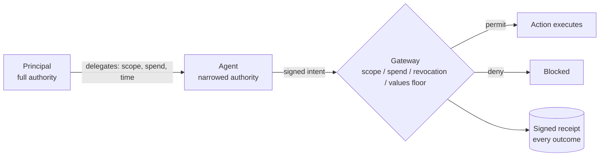

# AEOESS: Governance for the Agent Economy

AI agents represent companies and people. They spend real money, access sensitive data, negotiate contracts, and talk to other agents. The world runs on receipts; agents leave none. The **Agent Passport System (APS)** is the open protocol that fixes that: cryptographic identity, delegation that can only narrow, gateway enforcement, and a signed receipt for every action, permitted or denied.

Two rules carry the whole protocol. Authority can only decrease at each transfer point, never expand. And the gateway is judge and executor, not just an approver: nothing runs without an evaluation, and every evaluation leaves a verifiable record.

## Start here

- **Building an agent or integration** → [`agent-passport-system`](https://github.com/aeoess/agent-passport-system). `npm install agent-passport-system`, import the ~24 curated core functions, working in minutes. Adapters for [CrewAI](https://github.com/aeoess/agent-passport-system/blob/main/examples/crewai-governance.ts), [LangChain](https://github.com/aeoess/agent-passport-system/blob/main/src/adapters/langchain.ts), [Google ADK](https://github.com/aeoess/agent-passport-system/blob/main/src/adapters/adk.ts), [A2A](https://github.com/aeoess/agent-passport-system/blob/main/src/adapters/a2a.ts).
- **Using Claude, Cursor, or any MCP client** → [`agent-passport-system-mcp`](https://github.com/aeoess/agent-passport-mcp). `npx agent-passport-system-mcp` exposes the protocol as tools, 20 essential by default, 150 total.
- **Verifying someone else's implementation** → [`aps-conformance-suite`](https://github.com/aeoess/aps-conformance-suite). Byte-identical vectors; bring your canonicalizer.
- **Researching or writing standards** → the [eight papers](https://agent-passport.org/research) with Zenodo DOIs, the IETF Internet-Draft [`draft-pidlisnyi-aps`](https://datatracker.ietf.org/doc/draft-pidlisnyi-aps/), and the [agent-governance-vocabulary](https://github.com/aeoess/agent-governance-vocabulary) registry.

## What we ship

| Package | What | Install |
|---------|------|---------|
| [agent-passport-system](https://github.com/aeoess/agent-passport-system) | TypeScript SDK, the canonical reference. 107 modules (84 core + 23 v2 constitutional), 3,842 tests. Identity, delegation chains, cascade revocation, values floor, policy engine, agentic commerce, gateway enforcement, attribution, data lifecycle governance | `npm i agent-passport-system` |
| [agent-passport-system-mcp](https://github.com/aeoess/agent-passport-mcp) | MCP server, 150 tools across the protocol surface. Claude Desktop, Claude Code, Cursor, Windsurf, any MCP client | `npx agent-passport-system-mcp` |
| [Python SDK](https://pypi.org/project/agent-passport-system/) | Python implementation of the protocol | `pip install agent-passport-system` |
| [Go SDK](https://pkg.go.dev/github.com/aeoess/agent-passport-go) | Go implementation, byte-parity-checked against the TypeScript reference | `go get github.com/aeoess/agent-passport-go` |
| [@aeoess/storage-sqlite](https://github.com/aeoess/agent-passport-storage-sqlite) | SQLite persistence: WAL mode, atomic transactions, GDPR tombstoning, signed checkpoints | `npm i @aeoess/storage-sqlite` |
| [agent-passport.org](https://agent-passport.org) | Protocol docs, threat model (38 adversarial scenarios), research index, LLM-readable endpoints | [agent-passport.org](https://agent-passport.org) |
| [Agent Ecosystem Directory](https://aeoess.github.io/agent-ecosystem-map/) | Community directory of projects, people, and threads in agent infrastructure, live GitHub data | [repo](https://github.com/aeoess/agent-ecosystem-map) |

## The protocol in one pass

**Identity**: Ed25519 passports, did:aps, key rotation; bring-your-own-identity accepted (did:key, did:web, SPIFFE, OAuth). **Delegation**: chains with monotonic narrowing and cascade revocation. **Enforcement**: the gateway boundary checks scope, spend, revocation, and values floor at execution time. **Receipts**: signed records for every verdict, recomputable correlation via action_ref. **Commerce**: 5-gate checkout with human approval and cumulative spend tracking. **Attribution**: Merkle proofs from action back to a named principal. **Governance**: charters, offices, approval policies, federation. **Data lifecycle**: access receipts, derivation chains, consent revocation, purpose-drift detection.

Each receipt states what it proves and what it does not prove. The protocol describes admissibility, not truth.

## Standards and research

- **IETF Internet-Draft**: [draft-pidlisnyi-aps](https://datatracker.ietf.org/doc/draft-pidlisnyi-aps/)
- **Papers** (Zenodo DOIs): [The Agent Social Contract](https://doi.org/10.5281/zenodo.18749779) · [Monotonic Narrowing](https://doi.org/10.5281/zenodo.18932404) · [Faceted Authority Attenuation](https://doi.org/10.5281/zenodo.19260073) · [Behavioral Derivation Rights](https://doi.org/10.5281/zenodo.19476002) · [Physics-Enforced Delegation](https://doi.org/10.5281/zenodo.19478584) · [Governance in the Medium](https://doi.org/10.5281/zenodo.19582550) · [Cognitive Attestation](https://doi.org/10.5281/zenodo.19646276) · [The Evidence-Safety Gap](https://doi.org/10.5281/zenodo.19914628)
- **Vocabulary registry**: [agent-governance-vocabulary](https://github.com/aeoess/agent-governance-vocabulary), canonical names and per-system crosswalks, 32 contributed crosswalk files

Apache-2.0 across the protocol. Copyright 2026 Tymofii Pidlisnyi.
